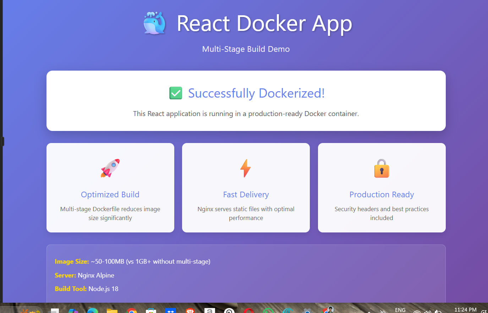
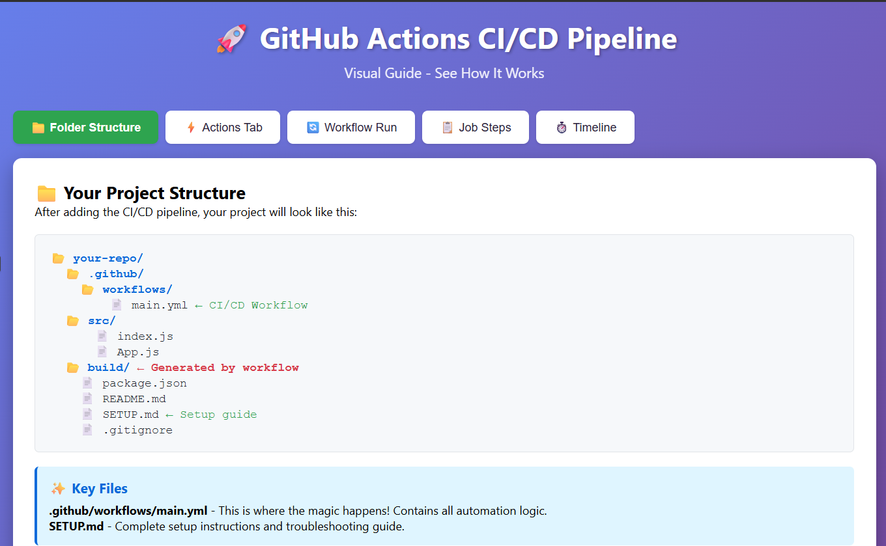
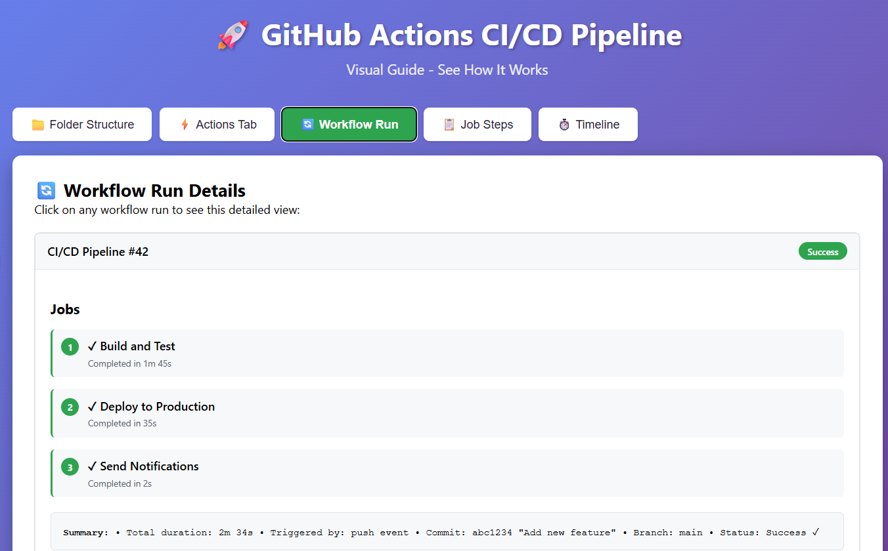
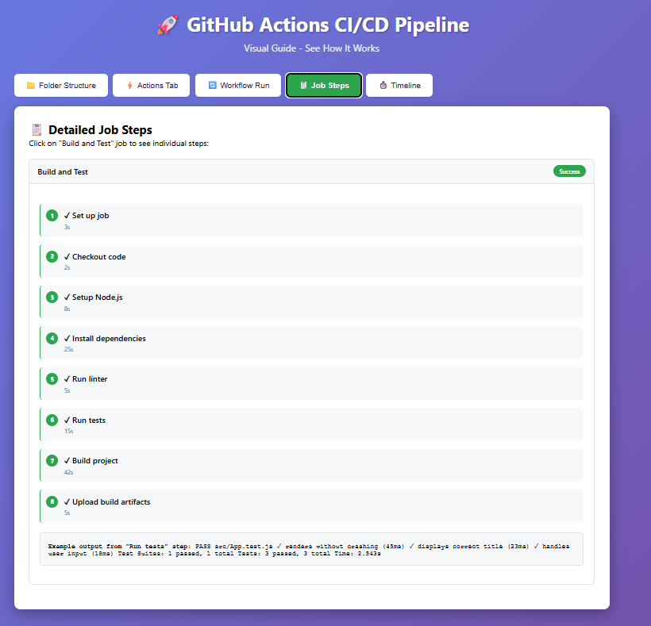
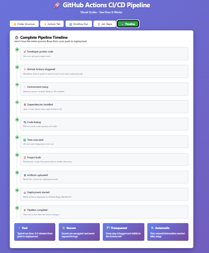

# 🐳 React CI/CD Demo

This is a **React Dockerized Application** with a simple CI/CD workflow.

## 🖼️ Output Preview







## 🚀 Features
- Multi-stage Docker build for smaller images  
- Nginx-based static hosting  
- GitHub Actions CI/CD ready (renamed folder for upload visibility)

## 🧠 Folder Structure
```
react-ci-cd-upload/
├── Dockerfile
├── package.json
├── README.md
├── src/
│   └── App.js
├── public/
│   └── index.html
├── github_workflows/
│   └── ci-cd.yml
└── output/
    └── output_1.png
```


